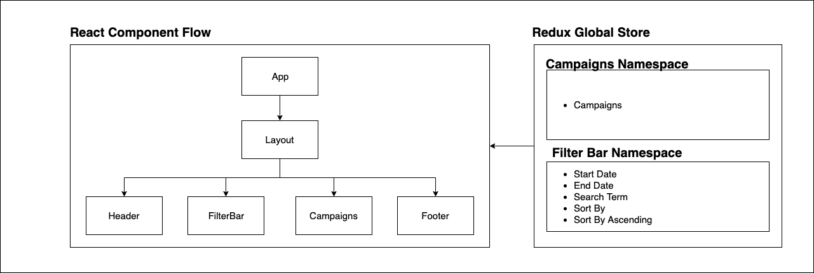

<h1>Campaigns App using React</h1>
<h2><a href="http://assessment.kish.rocks.s3-website-ap-southeast-1.amazonaws.com">Demo</a></h2>
<h2>Features</h2>
<ul>
    <li>This project shows a list of campaigns.</li>
    <li>
        User can add campaigns using AddCampaigns method. Campaigns should be passed in as an array of JSON objects. Each campaign should have following fields:
        <ul>
            <li><b>id</b>: A number, preferably unique</li>
            <li><b>name</b>: Campaign name</li>
            <li><b>startDate</b>: Start date of the campaign in M/D/YYYY format. Example: 10/26/2019.</li>
            <li><b>endDate</b>: End date of the campaign in M/D/YYYY format. <b>endDate should be greater than startDate.</b></li>
            <li><b>Budget</b>: Budget for the campaign.</li>
            <li>If the campaigns parameter is not an array or some of the campaigns are not valid, they are not added to the existing campaigns. User will be notifed using logs.</li>
        </ul>
    </li>
    <li>User can filter the campaigns data by selecting a range for the start and end dates using the date picker.</li>
    <li>Similarly, user can also filter by the campaign name using the search bar</li>
    <li>If campaign is currently active, green indicator is displayed. If not, red is displayed.</li>
    <li>User can sort the campaigns by clicking on the headers.</li>
</ul>

<h2>High Level Overview</h2>

<ul>
    <li>Main components in the application are Campaigns and FilterBar.</li>
    <li>Campaigns lists all valid campaigns.</li>
    <li>FilterBar lists all filters to filter the campaigns.</li>
    <li>Application used redux package as it is easy to share the global store between components without the need of passing properties to child components.</li>
    <li>Application is tested for unit test cases with jest and enzyme packages.</li>
    <li>AWS S3 Bucket is used to deploy the application. Link is mentioned in the beginning. Since it is a static website, S3 fits the purpose well.</li>
</ul>
